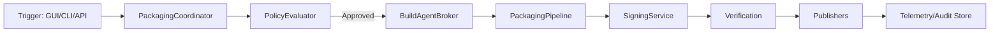
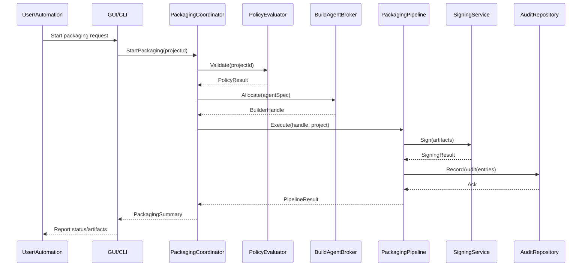

# Solution Architecture Overview

## 1. Solution Layout & Modules

```
PackagingTools/
├── src/
│   ├── PackagingTools.App/        # Avalonia GUI
│   ├── PackagingTools.Cli/        # Command-line interface
│   ├── PackagingTools.Core/       # Shared orchestration & services
│   └── PackagingTools.Plugins/    # Extension packages
├── build/                         # Bootstrap & infrastructure scripts
├── tools/                         # Auxiliary utilities & diagnostics
├── tests/                         # Automated test suites
├── samples/                       # Demonstration projects & recipes
└── docs/                          # Documentation, ADRs, compliance evidence
```

- Projects will target `.NET 10` as baseline to align with modern SDK distribution, while remaining compatible with `.NET 8/9` for CLI scenarios where required.
- `PackagingTools.Core` exposes interfaces (`IPackagingPipeline`, `ISigningService`, `IPolicyEvaluator`) consumed by GUI/CLI and extension points.
- `PackagingTools.Plugins` compiles independent assemblies that register with the core via MEF-like or DI-based discovery.

## 2. Architectural Layers

| Layer | Responsibilities | Key Technologies |
| --- | --- | --- |
| Presentation | Avalonia desktop UI, CLI command handlers, REST/gRPC endpoints. | Avalonia UI, System.CommandLine, ASP.NET Core minimal services. |
| Application | Orchestration, workflow state machines, policy enforcement. | `PackagingTools.Core`, MediatR-style pipelines, FluentValidation. |
| Domain | Packaging abstractions, project schema, signing & telemetry contracts. | C# records, JSON schema, gRPC DTOs. |
| Infrastructure | OS-specific packagers, signing adapters, storage providers, telemetry emitters. | MSIX SDK, WiX, `codesign`, `productbuild`, Flatpak CLI, Azure Key Vault SDK, SQLite/EF Core, OpenTelemetry. |

## 3. Packaging Engine Abstractions

- **IPackagingProjectStore**: CRUD for project definitions, supports multi-tenant namespaces and version history.
- **IPackagingPipeline**: Executes build → sign → verify → publish phases; pipelines are composed from reusable steps.
- **IPackageFormatProvider**: Format-specific implementation (e.g., MSIXProvider, DmgProvider) loaded via dependency injection.
- **ISigningService**: Abstracts local certificate stores, remote HSMs, and cloud KMS providers.
- **IPolicyEvaluator**: Evaluates compliance rules (signing required, reviewer approvals, retention) before pipeline execution.
- **ITelemetryChannel**: Emits structured events with privacy-aware filtering.

### Sequence: Packaging Run (Textual)
1. User/automation triggers `StartPackagingAsync(projectId, targetEnvironment)`.
2. `PackagingCoordinator` loads project configuration from `IPackagingProjectStore`.
3. `IPolicyEvaluator` validates prerequisites (approvals, signing assets, policy checks).
4. Required build environments are resolved via `IBuildAgentBroker` (local or remote).
5. `IPackagingPipeline` orchestrates format providers; each step logs progress via `ITelemetryChannel`.
6. `ISigningService` signs binaries/installers; receipts stored in `AuditRepository`.
7. Verification step ensures artifacts meet policy checks (hash, notarization, repo metadata).
8. Artifacts published to configured destinations; summary persisted for dashboards and CLI output.

## 4. Install & Configuration Services

- **Distribution Strategy:** Ship the CLI as a .NET global tool (`PackagingTools.Cli`) with OS-specific re-packaging for environments below SDK 10, mirroring current accelerate flow. GUI binaries distributed via native installers generated by PackagingTools itself.
- **Initial Configuration Flow:**
  1. First-run wizard validates prerequisites (SDK, platform toolchains) and offers to bootstrap missing dependencies.
  2. Users optionally connect to remote services (signing agents, artifact stores) through secure secret entry backed by OS keychains.
  3. CLI honors the same configuration files and environment variables, enabling unattended automation without additional gating.
- **Offline Support:** Provide export/import of dependency caches and configuration bundles so environments without internet access can run packaging pipelines.
- **Updates:** Build scripts under `build/` provide commands to check for updates, pre-download toolchains, and roll back if validation fails.

## 5. Configuration & Persistence

- **Project Schema:** JSON files stored alongside projects with strongly typed models (System.Text.Json) and JSON Schema documents for validation.
- **Central Store:** SQLite (via EF Core) used for metadata such as build history, audit logs, and policy assignments. Optional switch to PostgreSQL for multi-user server deployments.
- **Secrets:** Abstracted `ISecretProvider` chooses best backend per OS (Windows Credential Manager, macOS Keychain, Linux libsecret); enterprise mode supports Azure Key Vault/HashiCorp Vault connectors.
- **Caching:** `build/` scripts manage cached packaging toolchains; metadata stored in SQLite table with checksum to ensure integrity.

## 6. Diagrams (Mermaid)





## 7. Remote Build & Agent Strategy

- `IBuildAgentBroker` manages pools of agents per OS, supporting:
  - Local execution (default).
  - Self-hosted agents registered via mutual TLS.
  - Managed cloud agents (future enterprise add-on).
- Agents authenticate using short-lived tokens issued by `AgentProvisioningService`.
- Artifacts transferred via secure channels (SFTP, HTTPS) with checksum validation.

## 8. Policy & Governance Engine

- Policies defined as declarative rules stored in JSON/YAML, evaluated using expression language (e.g., Rego or custom DSL).
- Enforcement points:
  - Pre-flight checks (signing assets, approvals, environment readiness).
  - Post-build validation (SBOM presence, vulnerability scan results).
- Audit trail persisted with immutable event log (append-only table) and exportable to CSV/JSON for compliance.

## 9. Telemetry & Observability

- OpenTelemetry for metrics and traces; Application Insights exporters provided out-of-box.
- Privacy controls ensure PII-free logs, with organization-level toggles configured in GUI/CLI.
- Diagnostics bundles packaged for support, capturing logs, telemetry snapshots, agent health, and environment metadata.

## 10. Review & Next Steps

- Architecture decision records (ADRs) to be created under `docs/architecture/adr/` per major decision (runtime target, persistence, plugin model, configuration strategy).
- Schedule stakeholder review covering:
  - Solution layout & interfaces.
  - Configuration assumptions.
  - Infrastructure requirements (agents, storage, telemetry).
- Capture feedback and update this document alongside ADRs before moving to Milestone 3 implementation workstreams.
